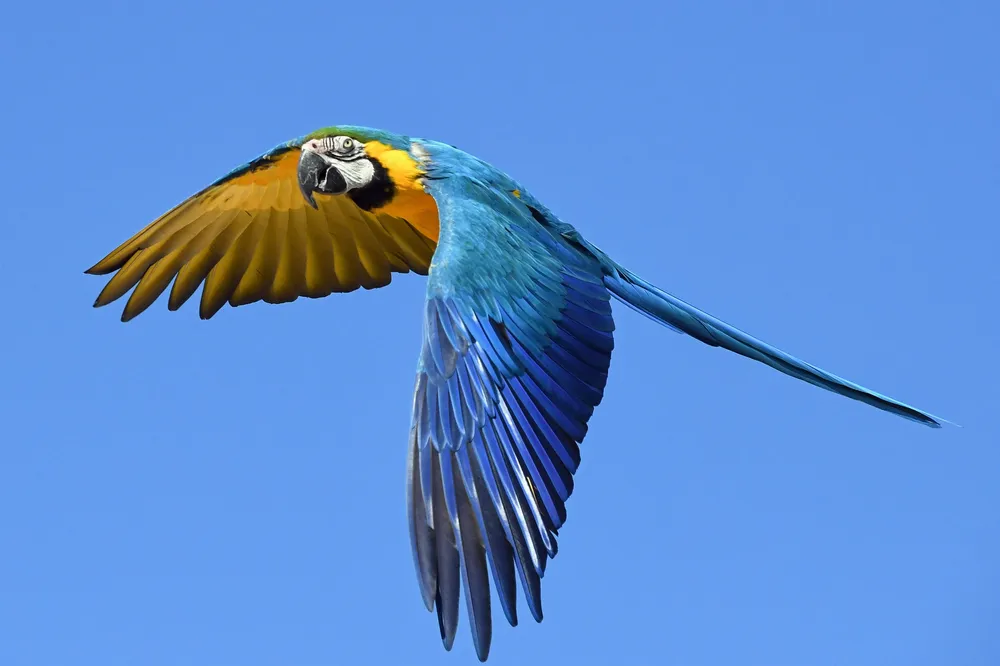

# My First Post

Welcome to my first blog post! In this post, we'll explore how to set up a project that uses **Flutter** as a frontend and **Golang** as a backend with **gRPC**.

## Setting Up the Project

First, create a directory structure like this:
